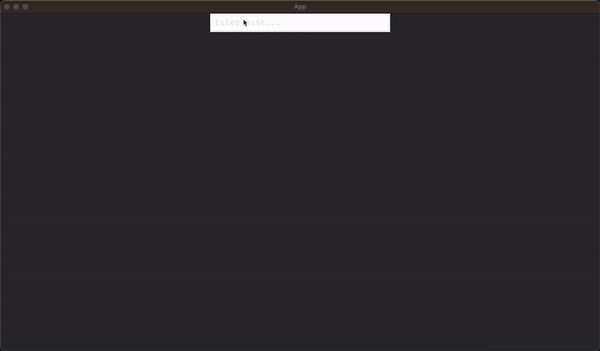

## Preface

Imagine a parallel universe where there weren't any JavaScript but
rather there were secure **WASM**, beautiful **wgpu**, fast
**WebTransport** protocol. Imagine a browser written in **Bevy**,
imagine everything written in secure and blazingly fast **Rust**. Let me
introduce you to [levo](https://github.com/velostudio/levo). Levo is a
browser (we call it portal), example server and example client app
(a.k.a web-site). No, it's not production ready. This is just prototype
to explore the idea.

## Demo



## Levo high-level architecture

Client application can be written in different languages that compiles
to wasm. To create wasm file that can be consumed later by
[wasmtime](https://github.com/bytecodealliance/wasmtime) runtime the
steps from
[client-app/readme.md](https://github.com/velostudio/levo/blob/main/client-app/readme.md)
should be taken. Client app can use rust std and any host (portal)
functions. Interface of available host functions declared in
`spec/host.wit` file:

``` wit
package levo:portal;

interface my-imports {
    print: func(msg: string);
    fill-style: func(color: string);
    fill-rect: func(x: float32, y: float32, width: float32, height: float32);
    begin-path: func();
    move-to: func(x: float32, y: float32);
    cubic-bezier-to: func(x1: float32, y1: float32, x2: float32, y2: float32, x3: float32, y3: float32);
    arc: func(x: float32, y: float32, radius: float32, sweep-angle: float32, x-rotation: float32);
    close-path: func();
    fill: func();
    label: func(text: string, x: float32, y: float32, size: float32, color: string);
}

world my-world {
  import my-imports;

  export update: func();

  export setup: func();
}
```

The client's output wasm file with embedded wit definitions is encoded
using small `brotli-encoder` tool that uses `brotli` rust crate.

`levo-server` uses brotli encoded file and using `webransport` rust
crate response to portal request with encoded wasm file. WebTransport
protocol allows quick transfer of client app to the portal using UDP
packets.

`portal` app is the meat of the project, it's written in `Bevy` that
gives easy access to `winit` , `wgpu` and whole bunch of other awesome
things. In current form it has just one text input field that accepts
[URL]{.underline} of the machine that runs levo-server. After entering
[URL]{.underline} and pressing Enter portal connects to the server,
downloads encoded brotli wasm file, decodes it, initializes `wasmtime`
runtime like so:

``` rust
// Set up Wasmtime components
let mut config = Config::new();
config.wasm_component_model(true).async_support(false);
let engine = Engine::new(&config)?;
let component = Component::new(&engine, decoded_input)?;

// Set up Wasmtime linker
let mut linker = Linker::new(&engine);
sync::add_to_linker(&mut linker)?;
let table = Table::new();
let wasi = WasiCtxBuilder::new().build();
MyWorld::add_to_linker(&mut linker, |state: &mut MyCtx| state)?;
// Set up Wasmtime store
let mut store = Store::new(
    &engine,
    MyCtx {
        table,
        wasi,
        channel: cc,
    },
);
let (bindings, _) = MyWorld::instantiate(&mut store, &component, &linker)?;
```

Then, it runs client\'s **setup** function once and **update** every
frame. Since those functions can use any host functions declared in
**wit** file the host app also provides implementation for those
functions (e.g. if client calls [cubic-bezier-to]{.underline} function -
host will call corresponding `bevy_prototype_lyon` function to draw
cubic bezier curve).

`wasmtime`{.verbatim} uses **component model** and **wasi**:

> WASI is designed with capability-based security principles, using the
> facilities provided by the Wasm component model. All access to
> external resources is provided by capabilities.

This allows to run any client code without giving any security risk to
the host machine.

## The end (just a beginning)

Imagine people can use **Rust**, **C**, **C++**, **Java**, **Go** (take
a look at
[my-component.go](https://github.com/velostudio/levo/blob/main/go-client-app/my-component.go))
to write client apps that can be easily distributed via HTTP3 and
executed securely using **wasmtime** runtime, **bevy** is used as portal
(a.k.a. browser). Next steps could be exposing low level API such as
`wgpu`{.verbatim} and `winit`{.verbatim}. Giving guest apps such low
level API will allow truly native desktop app experience that is
distributed via URL. The best of both words all in one!


